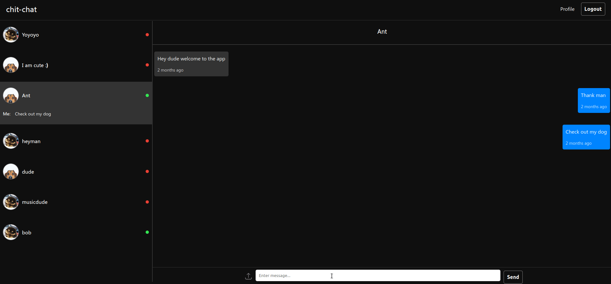

# Chit Chat



Chit Chat is an app where users can message other logged-in users in real-time. The primary focus of this app is to block toxic messages using a filter.

## Features

- **User Authentication:** Sign up and login to access the chat.
- **Real-time Chat:** Select a user to chat with and send messages in real time, thanks to Firebase.
- **User Status:** Users are displayed in green when online and red when offline. New users are updated in real time.
- **Private Route:** Main chat is set up with a private route, redirecting unauthenticated users to the login page.
- **Profile Customization:** Update your profile image and view it on your profile page.
- **Image Upload:** Share images in the chat.
- **New Message Alert:** Get alerted for new messages, even from offline users.
- **Toxicity Filter:** Tensorflow.js is used to identify and block toxic messages, replacing them with a warning and specifying the type of toxic message and its probability.
- **Context Awareness:** The toxicity filter doesn't just check for specific words but considers their context to avoid false positives.
- **Responsiveness:** The app is designed to work seamlessly on all screen types, including browsers, tablets, and phones.

## Tech Stack

This application is built with the following technologies:

- [React Native](https://reactnative.dev/)
- [Firebase](https://firebase.google.com/)
- [Tensorflow.js](https://www.tensorflow.org/js)

## Getting Started

These instructions will get you a copy of the project up and running on your local machine for development and testing purposes.

### Prerequisites

Before you begin, ensure you have installed:

- [Node.js](https://nodejs.org/)
- [npm](https://www.npmjs.com/)

### Installation

1. Clone the repo

```bash
git clone https://github.com/arfgit/chat-app.git
```

2. Install packages

```bash
npm install
```

3. Start the application

```bash
npm start
```

## Future Prospects

In the future, I am planning to:

- Revamp the design to enhance the user experience
- Integrate ChatGPT's API to improve the chat functionality
